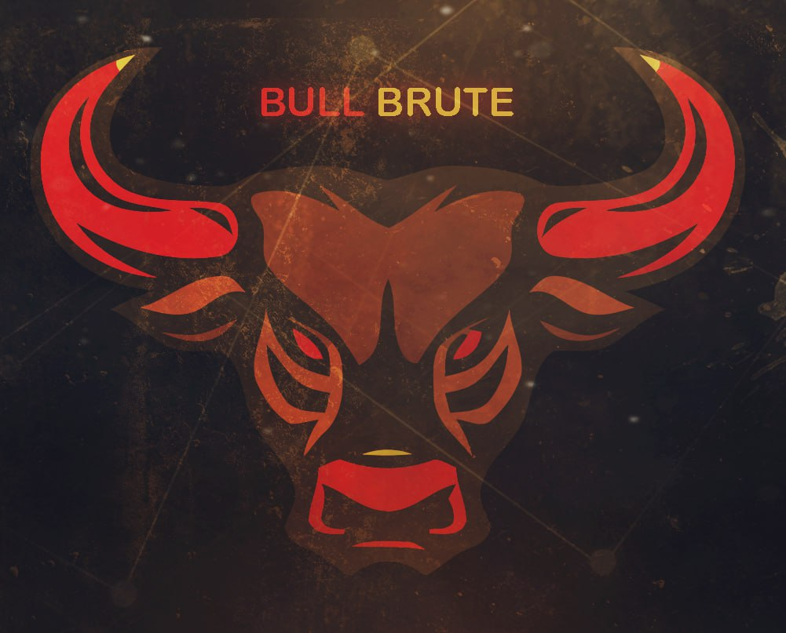
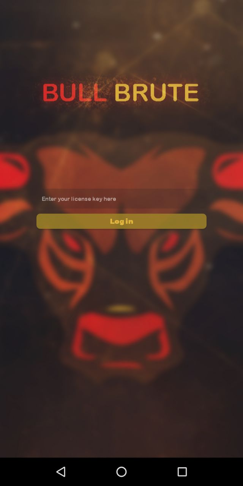
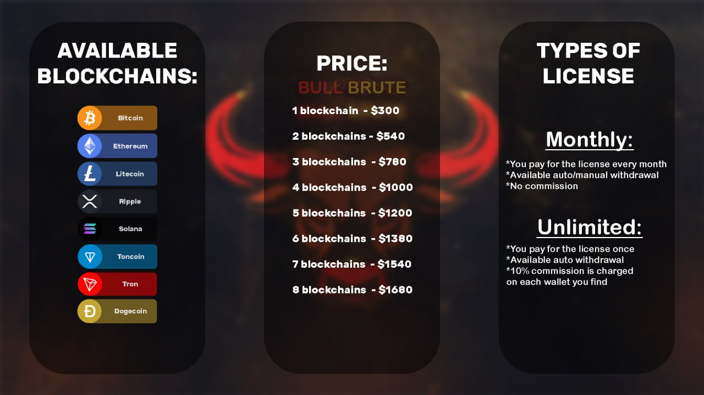
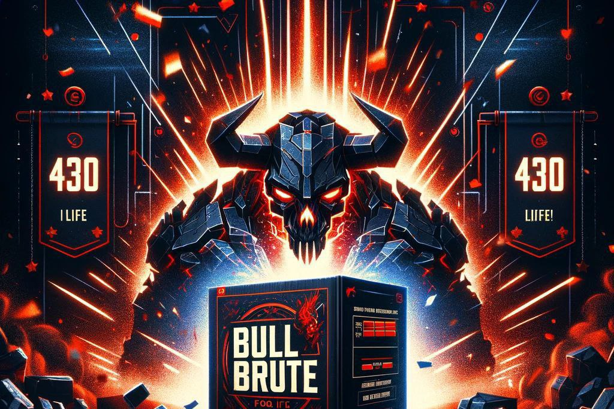

### HI. I'm HAMBALI  👩‍💻


⭐⭐⭐⭐⭐⭐
## Bull Brute:

- 💵I would like to introduce you to our mnemonic bruteforcing app. This is not a new method of earning, but still very effective

Any crypto address has its mnemonic phrase, which consists of 12 words. Knowing it you can get full access to the wallet. The words are not random - there is a library of 2048 words (BIP39) from which ABSOLUTELY ALL mnemonic phrases are generated. Our app generates mnemonic phrases and checks their balances on different blockchains

⬇️More details about this method below

⭐⭐⭐⭐⭐⭐
## Mod Features:

- Login Aplikasi Bull Brute

⭐⭐⭐⭐⭐⭐
## Mod Features:

- AVAILABLE VERSIONS: 

💻For Windows
📱For Android
🍏For MacOS

FAQ:

❓Which version is better?
- Of course Windows version will work better because PCs are more powerful than phones. But it doesn't mean that the phone version is bad. The phone version also shows great results. Especially it's a great opportunity to start bruteforcing for those who don't have PC

❓Is it possible to run the phone version on PC/laptop?
- Yes, of course, via any emulator

❓Is it better to use the mobile version on my phone or on my PC?
- No difference

📲If you have any questions - contact

## Mod Features:

- PRICE:

🎚️1 blockchain  - $300
🎚️2 blockchains - $540
🎚️3 blockchains  - $780
🎚️4 blockchains  - $1000
🎚️5 blockchains  - $1200
🎚️6 blockchains  - $1380
🎚️7 blockchains  - $1540
🎚️8 blockchains  - $1680

TYPES OF LICENSE:

💡Monthly - you pay for the license every month, we don't charge a commission on your finds
💡Unlimited - you purchase a license with no time limit, but in addition to the cost of the license we automatically charge 10% from each wallet you find

❗️TEST PERIOD  - $20 / 1 day

👨‍💻BUY LICENSE - @HAMBALI251298

⭐⭐⭐⭐⭐⭐
## Mod Features:

## Developers:
```Bull Brute By Hambali
```

